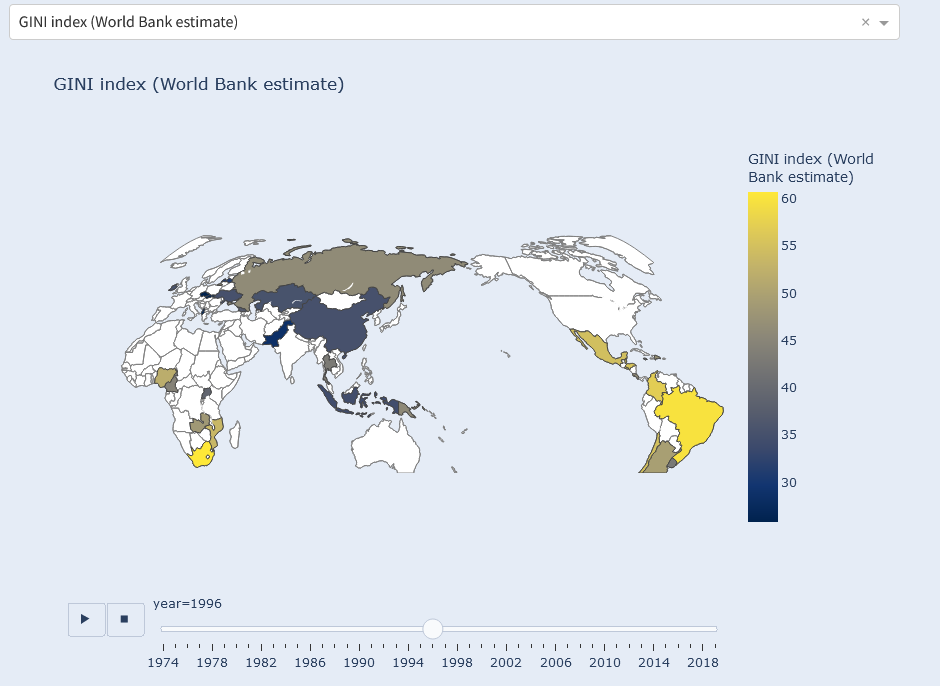
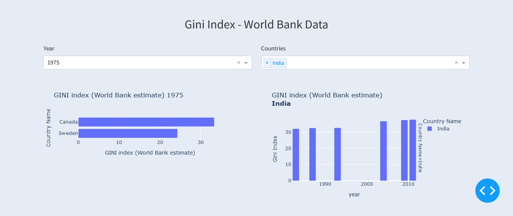
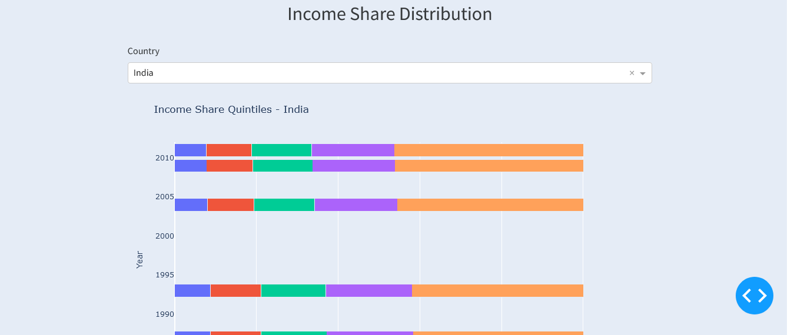
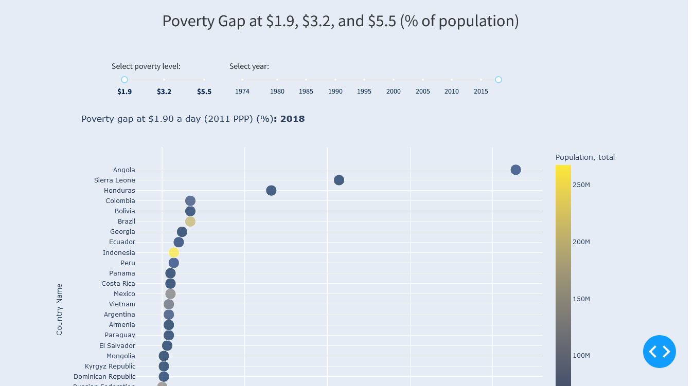
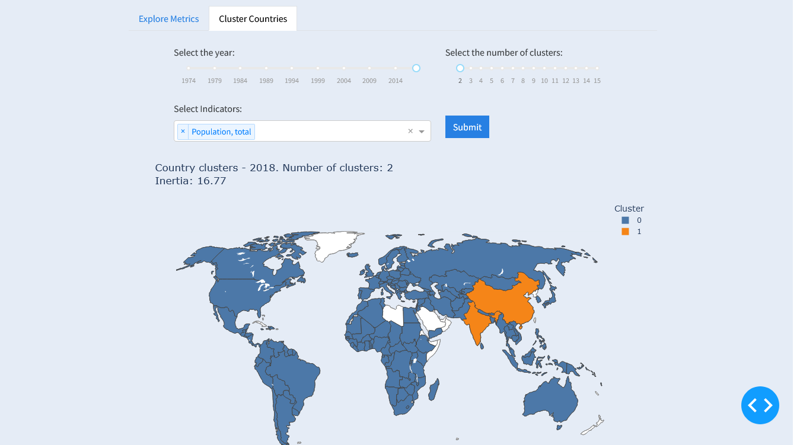

# Poverty Data Dashboard

## Link

https://poverty-and-equity-database.onrender.com/

## Overview

The Poverty Data Dashboard is an interactive web application designed to provide deep insights into global poverty and equity data from the World Bank. This tool allows users to explore, visualize, and analyze poverty trends, income distribution, and various socioeconomic indicators across 170 economies, spanning from 1974 to 2019.

## Screenshots

## Data Insights

The Poverty Data Dashboard enables users to gain valuable insights such as:

1. Identifying countries with the highest and lowest poverty rates over time
2. Analyzing the relationship between economic growth and poverty reduction
3. Comparing income inequality across different regions and income groups
4. Tracking progress towards poverty reduction goals
5. Examining the impact of economic policies on income distribution
6. Identifying clusters of countries with similar socioeconomic characteristics
7. Analyzing trends in extreme poverty and middle-class growth

## Data Sources

The application uses data from the World Bank's Poverty and Equity Database. Key information about this dataset includes:

* **Number of Economies**: 170
* **Temporal Coverage**: 1974 - 2019
* **Update Frequency**: Quarterly
* **Last Updated**: March 18, 2020
* **Source**: [World Bank Poverty and Equity Database](https://datacatalog.worldbank.org/dataset/poverty-and-equity-database)

## Technical Implementation

The dashboard is built using the following key libraries:

- **Dash**
- **Plotly**
- **Pandas**
- **NumPy**
- **scikit-learn**

## Detailed Feature Breakdown

### 1. Interactive World Map Visualization

The centerpiece of the dashboard is an interactive world map that offers a global perspective on poverty and equity indicators.

- **Dynamic Indicator Selection**: Users can choose from over 50 different indicators, including:
  - GINI index
  - Poverty headcount ratio at national poverty lines (% of population)
  - Income share held by lowest 20%
  - GDP per capita (current US$)
  - And many more

- **Time-Series Animation**: 
  - Observe how indicators change over time from 1974 to 2019
  - Play, pause, or manually scroll through years
  - Watch as countries change color to reflect evolving data

- **Color-Coded Visualization**:
  - Countries are shaded using a continuous color scale (Cividis)
  - Darker shades typically indicate higher values of the selected indicator
  - The color bar adapts to each indicator's range for optimal contrast

- **Interactive Hover Information**:
  - Hover over any country to see a tooltip with:
    - Country name
    - Year
    - Exact value of the selected indicator

- **Customizable View**:
  - Zoom in/out of the map
  - Pan across different regions
  - The map projection is set to 'natural earth' for a balanced global view

- **Indicator Metadata Display**:
  - Below the map, view detailed information about the selected indicator:
    - Long definition of the indicator
    - Unit of measure
    - Periodicity of data collection
    - Source of the data
    - Limitations and exceptions in data interpretation

### 2. Country-Specific Dashboards

Users can dive deep into data for individual countries, accessing a wealth of information and visualizations.

- **Country Selection**:
  - Choose any country from the dropdown menu in the navigation bar
  - Instantly navigate to a dedicated page for the selected country

- **Time Series Graphs**:
  - Interactive line charts showing trends over time
  - Select any indicator to visualize its progression for the chosen country
  - Option to add multiple countries for comparison

- **Country Metadata Display**:
  - View key information about the selected country:
    - Region
    - Income group
    - Special notes
    - System of national accounts
    - National accounts base year
    - Latest population census
    - Latest household survey
    - Source of most recent income and expenditure data

- **Data Table**:
  - Comprehensive table of all available indicators for the country
  - Sort and filter capabilities for easy data exploration

### 3. Histogram Analysis Tool

This feature allows users to examine the distribution of indicators across countries and compare distributions over different years.

- **Multi-Year Selection**:
  - Choose one or multiple years for comparison
  - Create faceted histograms for easy year-to-year distribution comparison

- **Flexible Binning**:
  - Adjust the number of bins from 0 to 100 using a slider
  - Observe how changing bin numbers affects the granularity of the distribution

- **Interactive Histogram**:
  - Hover over bars to see exact values
  - Zoom in on specific ranges of the indicator

- **Accompanying Data Table**:
  - View raw data used to create the histograms
  - Sort by any column (country, year, indicator value)
  - Filter data to focus on specific subsets
  - Export data to CSV for further analysis

### 4. Gini Index Visualization

A dedicated section for exploring the Gini index, a key measure of income inequality.

- **Year-Specific Bar Chart**:
  - Select any available year
  - View a horizontal bar chart of Gini index values for all countries
  - Countries are sorted from lowest to highest Gini index
  - Easily identify countries with the highest and lowest income inequality

- **Multi-Country Time Series**:
  - Select multiple countries for comparison
  - View a line chart showing Gini index trends over time
  - Each country is represented by a different color for easy differentiation

- **Interactive Elements**:
  - Hover over data points to see exact Gini index values
  - Click on legend items to hide/show specific countries

### 5. Income Share Distribution Analysis

This feature provides insights into how total income is distributed among different population segments within countries.

- **Stacked Bar Chart Visualization**:
  - Select any country to view its income distribution over time
  - Each bar represents a year, divided into five segments:
    1. Income share held by lowest 20%
    2. Income share held by second 20%
    3. Income share held by third 20%
    4. Income share held by fourth 20%
    5. Income share held by highest 20%

- **Color-Coded Segments**:
  - Each income quintile is represented by a different color
  - Easily observe how the proportion of income for each quintile changes over time

- **Interactive Features**:
  - Hover over segments to see exact percentage values
  - Zoom in on specific time periods for detailed analysis

### 6. Poverty Gap Analysis Tool

This tool allows users to examine poverty gaps at different poverty levels across countries and years.

- **Adjustable Poverty Level**:
  - Use a slider to select between three poverty levels:
    1. $1.9 per day
    2. $3.2 per day
    3. $5.5 per day

- **Year Selection**:
  - Choose any year from 1974 to 2019 using a slider

- **Interactive Scatter Plot**:
  - X-axis: Poverty gap (% of population)
  - Y-axis: Countries
  - Point size: Represents total population
  - Color intensity: Indicates severity of the poverty gap

- **Hover Information**:
  - Country name
  - Exact poverty gap percentage
  - Population size

- **Dynamic Updates**:
  - Plot updates instantly when changing poverty level or year
  - Observe how poverty gaps change across different thresholds and over time

### 7. K-means Clustering of Countries

This feature uses machine learning to group countries based on selected socioeconomic indicators.

- **Customizable Clustering**:
  - Select the year for analysis (1974-2018)
  - Choose the number of clusters (2-15)
  - Select multiple indicators for multidimensional clustering

- **Machine Learning Process**:
  - Uses K-means algorithm from scikit-learn
  - Handles missing data using mean imputation
  - Standardizes features for fair comparison

- **Interactive Choropleth Map**:
  - Countries colored by their assigned cluster
  - Hover over countries to see cluster assignment and indicator values

- **Clustering Quality Metric**:
  - Displays the inertia (within-cluster sum of squares) of the clustering
  - Helps users judge the optimal number of clusters

- **Indicator Selection**:
  - Choose any combination of available indicators
  - Explore how different indicator combinations affect country groupings

## Setup and Usage

1. Clone the repository and navigate to the project directory
2. Install required packages: `pip install -r requirements.txt`
3. Run the application: `python app.py`
4. Open a web browser and go to `http://127.0.0.1:8050/`

